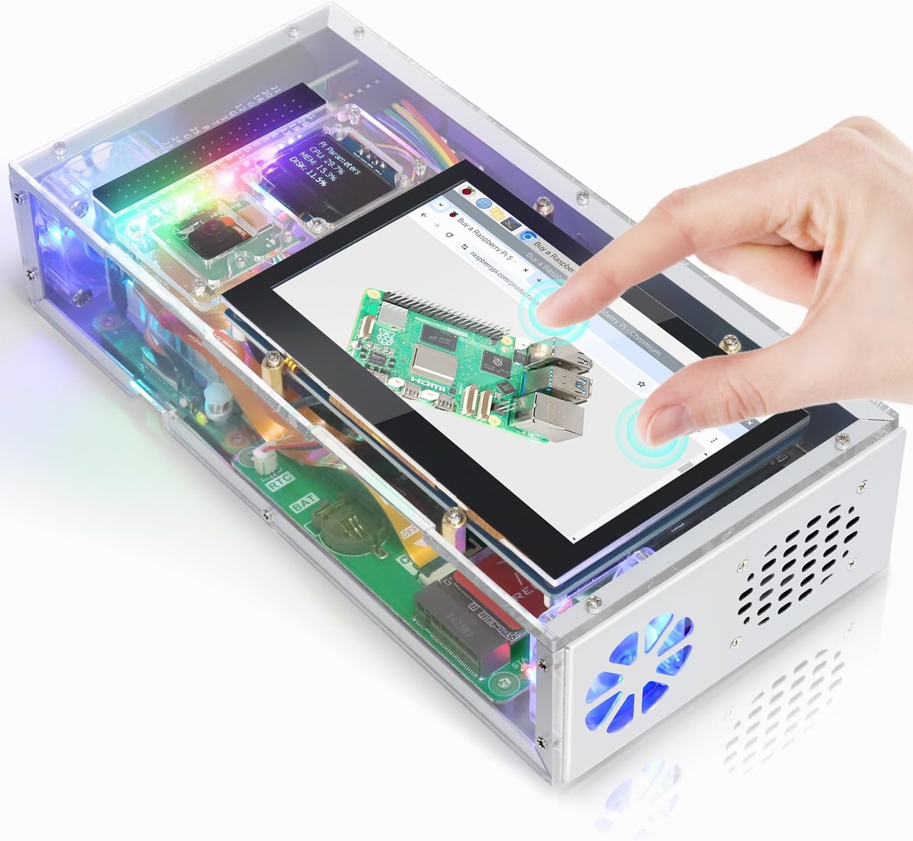
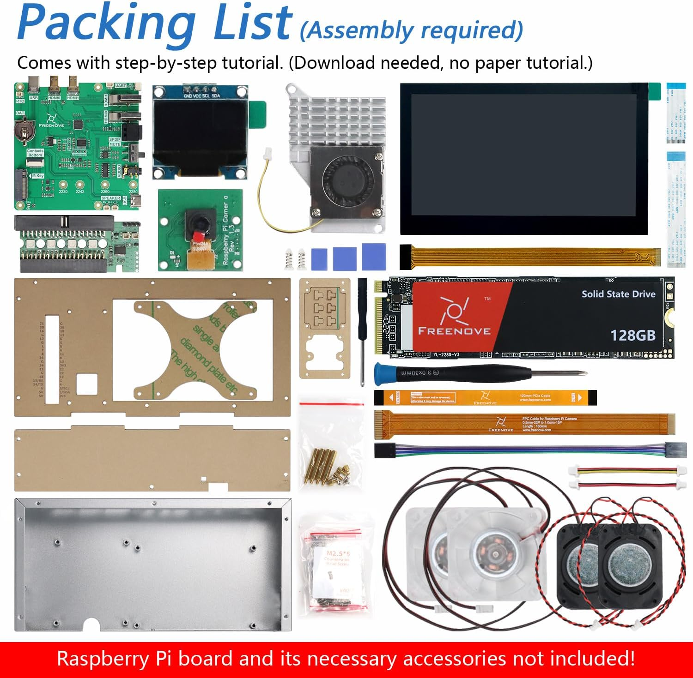
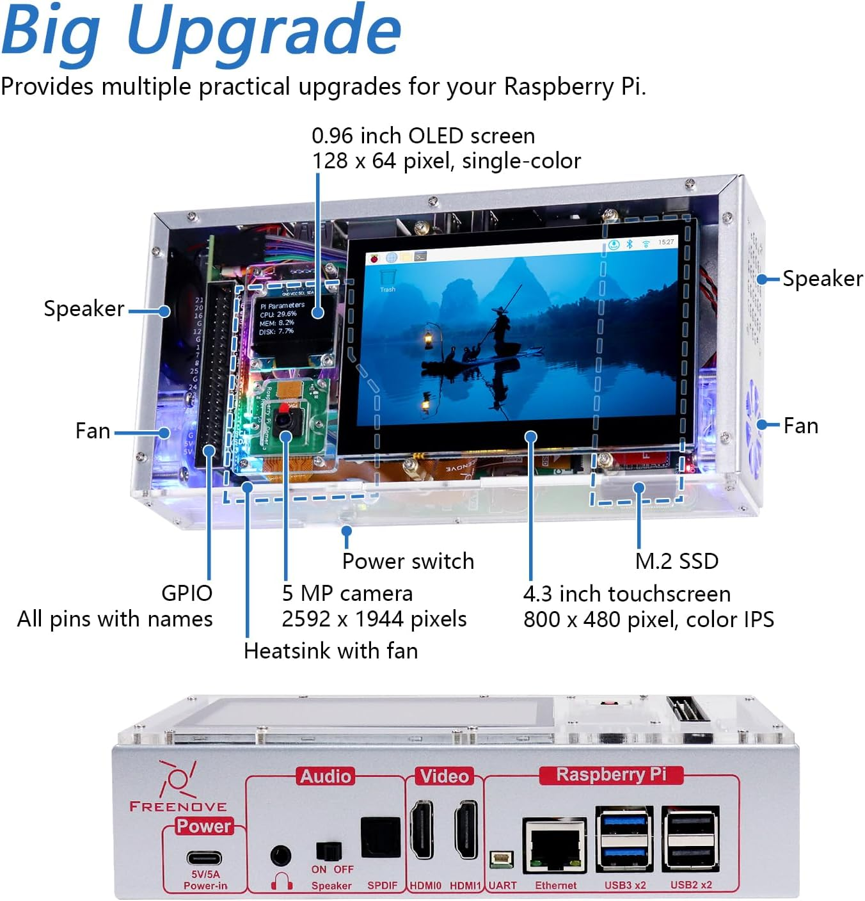
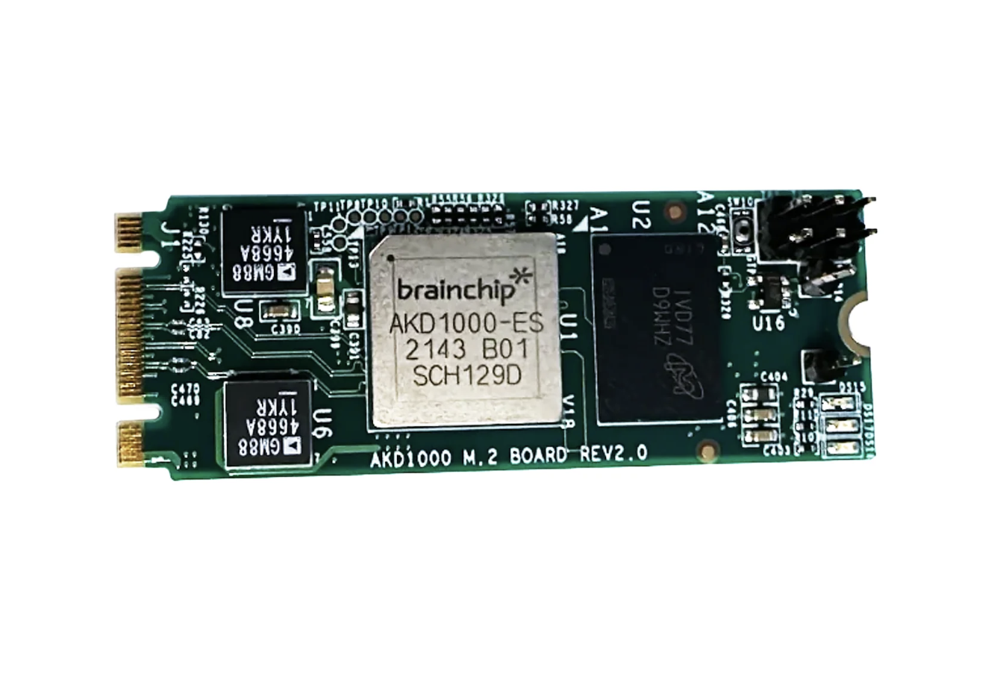

# Hardware Setup Guide

To get started with Project Echo, you'll need to assemble the hardware components. Here's a complete shopping list and assembly guide:

## Required Components

1. **Raspberry Pi 5 Starter Kit** - [Purchase on Amazon](https://amzn.to/48VZwn8)
   - Includes the Raspberry Pi 5 board and essential accessories

   
   
   

2. **Power Supply** - [Purchase on Amazon](https://amzn.to/44ZhVy4)
   - USB-C power cord (minimum 27W recommended)

3. **512GB microSD Card** - [Purchase on Amazon](https://amzn.to/48VH5Pk)
   - For the operating system and project files

4. **BrainChip Akida M.2 Card (B+M Key)** - [Purchase from BrainChip](https://shop.brainchipinc.com/products/m-2-card-m-key)
   - The neuromorphic accelerator card that powers Project Echo's AI capabilities

   

## Assembly Instructions

For step-by-step visual instructions on assembling your Raspberry Pi 5, watch this [assembly video](https://www.youtube.com/watch?v=wyHVcwiXlbg).

**Important Note:** In the video, when you reach the step for installing an SSD memory card, **instead install the BrainChip Akida M.2 Card (B+M Key)** that you purchased. The BrainChip card uses the same M.2 slot and follows the same installation process, but provides neuromorphic AI acceleration instead of storage expansion.

The BrainChip M.2 Card (B+M Key) is specifically designed for Raspberry Pi 5 and enables event-based neural network processing. For more details about the card's specifications and capabilities, see the [BrainChip product page](https://shop.brainchipinc.com/products/m-2-card-m-key).
